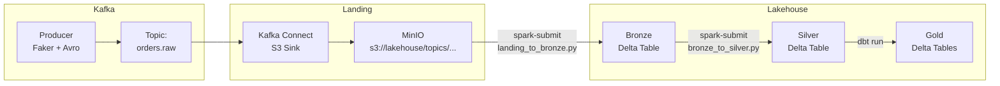
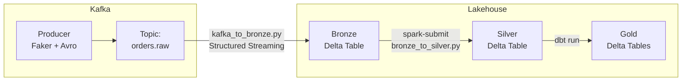

# Kafka Lakehouse POC -- Dual Architecture Comparison

A proof-of-concept that demonstrates and compares two production patterns for
streaming data ingestion from Apache Kafka into a Delta Lake lakehouse with a
medallion architecture (Bronze / Silver / Gold).

---

## Architecture Overview

### Architecture 1: Kafka Connect + Batch PySpark



**Data flow:**
1. Python producer publishes Avro-encoded events to `orders.raw`.
2. Kafka Connect S3 Sink connector batches messages and writes Parquet files to MinIO.
3. `landing_to_bronze.py` (PySpark batch) reads Parquet from MinIO, adds metadata, and writes Bronze Delta.
4. `bronze_to_silver.py` (PySpark batch) casts types, deduplicates, and merges into Silver Delta.
5. dbt gold models aggregate Silver into Gold Delta tables via the Spark Thrift Server.

### Architecture 2: PySpark Structured Streaming



**Data flow:**
1. Python producer publishes Avro-encoded events to `orders.raw`.
2. `kafka_to_bronze.py` (PySpark Structured Streaming) consumes directly from Kafka, strips the Confluent wire-format header, deserializes Avro, and writes Bronze Delta in micro-batches.
3. `bronze_to_silver.py` (PySpark batch) applies the same Silver logic as arch 1.
4. dbt gold models aggregate Silver into Gold Delta tables.

---

## Medallion Layer Definitions

| Layer | Format | Partitioning | Key transformations |
|---|---|---|---|
| Landing (arch 1) | Parquet (Snappy) | `year/month/day/hour` | None; raw Kafka bytes |
| Bronze | Delta Lake | `ingestion_date` | `_ingested_at`, `_source_file` / `_kafka_offset`, `_batch_id` |
| Silver | Delta Lake | `order_date` | Type casts, constraint validation, dedup (MERGE) |
| Gold | Delta Lake | None | Aggregations via dbt |

---

## Prerequisites

| Tool | Minimum version |
|---|---|
| Docker | 24.x |
| Docker Compose v2 | 2.24.x (`docker compose` subcommand) |
| RAM | 16 GB recommended (arch 1: ~7.3 GB, arch 2: ~5.8 GB) |
| Disk | 10 GB free |

Verify your setup:
```bash
docker --version
docker compose version
```

---

## Quick Start

### Architecture 1 (Kafka Connect)

```bash
# 1. Build images and start all services
cd arch1_kafka_connect
docker compose up -d --build

# 2. Watch producer logs
docker compose logs -f producer

# 3. Verify connector is running
curl -s http://localhost:8083/connectors/s3-sink-orders/status | python3 -m json.tool

# 4. Check MinIO for Parquet files (after ~60 seconds)
#    Open browser: http://localhost:9001  (minioadmin / minioadmin)

# 5. Run Landing → Bronze batch job
docker compose exec spark-master \
    spark-submit --master spark://spark-master:7077 \
    /jobs/arch1/landing_to_bronze.py

# 6. Run Bronze -> Silver batch job
docker compose exec spark-master \
    spark-submit --master spark://spark-master:7077 \
    /jobs/arch1/bronze_to_silver.py

# 7. Run dbt gold models
docker compose --profile dbt run --rm dbt

# 8. Tear down
docker compose down -v
```

### Architecture 2 (PySpark Streaming)

```bash
# 1. Build images and start all services
cd arch2_spark_streaming
docker compose up -d --build

# 2. Start the streaming bronze job (runs indefinitely)
docker compose exec spark-master \
    spark-submit --master spark://spark-master:7077 \
    /jobs/arch2/kafka_to_bronze.py

# 3. After bronze data accumulates, promote to silver
docker compose exec spark-master \
    spark-submit --master spark://spark-master:7077 \
    /jobs/arch2/bronze_to_silver.py

# 4. Run dbt gold models
docker compose --profile dbt run --rm dbt

# 5. Tear down
docker compose down -v
```

---

## Architecture Comparison

| Dimension | Arch 1: Kafka Connect | Arch 2: PySpark Streaming |
|---|---|---|
| **Latency to Bronze** | ~1 minute (flush interval) | ~60 seconds (trigger interval) |
| **Infrastructure complexity** | Higher (MinIO, Connect, connector config) | Lower (Spark only) |
| **Fault tolerance** | Kafka Connect offset management | Spark checkpoint dir |
| **Schema evolution** | Schema Registry + connector config | Schema Registry + UDF update |
| **Backfill / replay** | Re-run batch job from MinIO | Seek to earliest offset |
| **Cost analogy (cloud)** | MSK Connect + S3 + Glue | EMR Streaming |
| **Operational surface** | Multiple components to monitor | Single Spark application |
| **File size control** | `flush.size` + `rotate.schedule.interval.ms` | `maxOffsetsPerTrigger` + trigger interval |
| **Data format in landing** | Parquet (Snappy) | N/A (writes directly to Delta) |
| **Requires MinIO** | Yes | No |
| **Deduplication** | MERGE in Silver | MERGE in Silver |

---

## Inspecting Data with Spark SQL

Connect to the Spark Thrift Server on port `10000` from the Spark master container:

```bash
docker compose exec spark-master \
    /opt/bitnami/spark/bin/beeline \
    -u "jdbc:hive2://localhost:10000" \
    -e "SHOW DATABASES;"
```

Query the silver layer:

```sql
-- Row count
SELECT COUNT(*) FROM silver.orders;

-- Revenue by currency and date
SELECT order_date, currency, SUM(total_amount) AS revenue
FROM silver.orders
GROUP BY order_date, currency
ORDER BY order_date DESC;

-- Time-travel: read as of a specific version
SELECT COUNT(*) FROM delta.`/data/arch1/silver/orders` VERSION AS OF 0;
```

Query gold models:

```sql
SELECT * FROM gold.daily_revenue LIMIT 10;
SELECT * FROM gold.top_products LIMIT 10;
SELECT * FROM gold.order_status_summary LIMIT 10;
```

---

## Repository Structure

```
kafka_lakehouse/
├── PLAN.md                          Implementation plan
├── README.md                        This file
├── .env                             Version pins and global config
├── .gitignore
├── shared/
│   ├── producer/                    Avro event producer (Python)
│   ├── spark/                       Custom Spark + Delta Docker image
│   └── dbt_gold/                    dbt project with gold models
├── arch1_kafka_connect/
│   ├── docker-compose.yml
│   ├── connect/config/s3-sink.json  Connector configuration
│   └── jobs/
│       ├── landing_to_bronze.py
│       └── bronze_to_silver.py
└── arch2_spark_streaming/
    ├── docker-compose.yml
    └── jobs/
        ├── kafka_to_bronze.py
        └── bronze_to_silver.py
```

---

## Environment Variables

| Variable | Default | Description |
|---|---|---|
| `KAFKA_TOPIC` | `orders.raw` | Kafka topic name |
| `PRODUCER_INTERVAL_MS` | `100` | Delay between produced messages (ms) |
| `KAFKA_BOOTSTRAP_SERVERS` | `kafka:9092` | Kafka broker address (within Docker network) |
| `SCHEMA_REGISTRY_URL` | `http://schema-registry:8081` | Schema Registry endpoint |
| `ARCH_DATA_PATH` | `/data/arch1` or `/data/arch2` | Base path for lakehouse data layers |
| `START_THRIFT_SERVER` | `true` (master only) | Whether to start Spark Thrift Server |
| `DBT_SCHEMA` | `gold` | Target schema for dbt models |

---

## Known Limitations

1. **Single-node Kafka:** No replication. Not suitable for production.
2. **Spark Thrift Server:** Can be slow to start. If dbt fails to connect, wait 30-60 seconds and retry.
3. **Delta table registration:** The Spark catalog is in-memory. After restarting the `spark-master` container, the `silver.orders` table must be re-registered (handled automatically by the entrypoint script).
4. **Avro header stripping:** The `from_avro()` UDF approach does not use Schema Registry for deserialization. Schema ID in the header is ignored; the schema file on disk is used instead.
